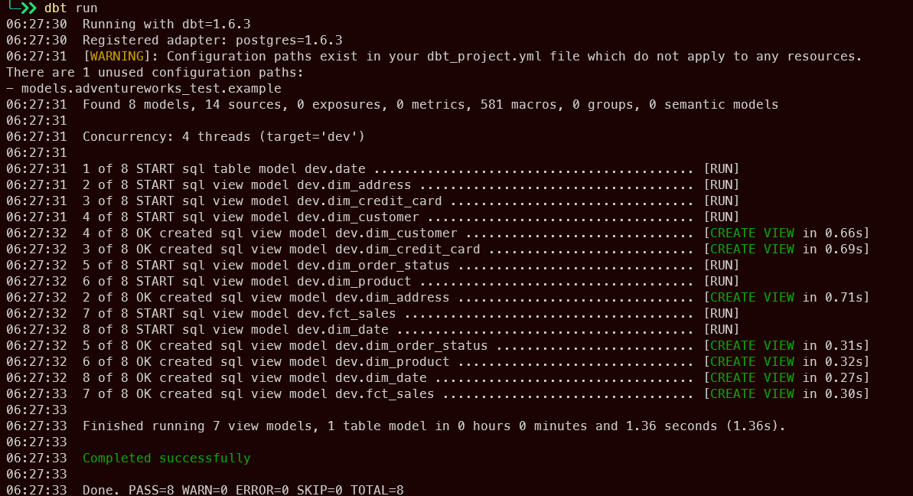
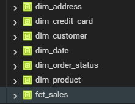

# 3. DBT

## A real world example of a dimension modelling with DBT

Data Set: Microsoft's Adventureworks 2014\
Database: PostgreSQL (using [custom script](https://github.com/lorint/AdventureWorks-for-Postgres/tree/master))

## Introduction

This is a real world case study of how [dbt](https://www.getdbt.com/) (data build tool) can be used to create dimension and fact tables (the T in ELT process).

By writing select statements as model and executing `dbt run`, the `sql` statement required to create/update/insert will automatically be generated.

This repo only contains code to models and relevant configs.

## Process

Write models for dimension and fact tables (Only show Product Dimension Table and Sales Fact Table, source code for other models are in the models folder).

`dim_product` (Product Dimension Table)

```sql
WITH stg_product AS (
    SELECT
        *
    FROM
        {{ source(
            'production',
            'product'
        ) }}
),
stg_product_subcategory AS (
    SELECT
        *
    FROM
        {{ source(
            'production',
            'productsubcategory'
        ) }}
),
stg_product_category AS (
    SELECT
        *
    FROM
        {{ source(
            'production',
            'productcategory'
        ) }}
)
SELECT
    {{ dbt_utils.generate_surrogate_key(['stg_product.productid']) }} AS product_key,
    stg_product.productid,
    stg_product.name AS product_name,
    stg_product.productnumber,
    stg_product.color,
    stg_product.class,
    stg_product_subcategory.name AS product_subcategory_name,
    stg_product_category.name AS product_category_name
FROM
    stg_product
    LEFT JOIN stg_product_subcategory
    ON stg_product.productsubcategoryid = stg_product_subcategory.productsubcategoryid
    LEFT JOIN stg_product_category
    ON stg_product_subcategory.productcategoryid = stg_product_category.productcategoryid

```

\
`fct_sales` (Sales Fact Table)

```sql
WITH stg_salesorderheader AS (
    SELECT
        salesorderid,
        customerid,
        creditcardid,
        shiptoaddressid,
        status AS order_status,
        CAST(
            orderdate AS DATE
        ) AS orderdate
    FROM
        {{ source(
            'sales',
            'salesorderheader'
        ) }}
),
stg_salesorderdetail AS (
    SELECT
        salesorderid,
        salesorderdetailid,
        productid,
        orderqty,
        unitprice,
        unitprice * orderqty AS revenue
    FROM
        {{ source(
            'sales',
            'salesorderdetail'
        ) }}
)
SELECT
    {{ dbt_utils.generate_surrogate_key(['stg_salesorderdetail.salesorderid', 'salesorderdetailid']) }} AS sales_key,
    {{ dbt_utils.generate_surrogate_key(['productid']) }} AS product_key,
    {{ dbt_utils.generate_surrogate_key(['customerid']) }} AS customer_key,
    {{ dbt_utils.generate_surrogate_key(['creditcardid']) }} AS creditcard_key,
    {{ dbt_utils.generate_surrogate_key(['shiptoaddressid']) }} AS ship_address_key,
    {{ dbt_utils.generate_surrogate_key(['order_status']) }} AS order_status_key,
    {{ dbt_utils.generate_surrogate_key(['orderdate']) }} AS order_date_key,
    stg_salesorderdetail.salesorderid,
    stg_salesorderdetail.salesorderdetailid,
    stg_salesorderdetail.unitprice,
    stg_salesorderdetail.orderqty,
    stg_salesorderdetail.revenue
FROM
    stg_salesorderdetail
    INNER JOIN stg_salesorderheader
    ON stg_salesorderdetail.salesorderid = stg_salesorderheader.salesorderid
```

## Result

`dim_product` (Product Dimension Table)
| Product Key | ID | Product Name | Product Number | Color | Size |
| ----------------------------------- | --- | -------------------- | -------------- | ------- | ---- |
| c4ca4238a0b923820dcc509a6f75849b | 1 | Adjustable Race | AR-5381 | | |
| c81e728d9d4c2f636f067f89cc14862c | 2 | Bearing Ball | BA-8327 | | |
| eccbc87e4e5ce2fe28308fd9f2a7baf3 | 3 | BB Ball Bearing | BE-2349 | | |
| a87ff679a2f3e71d9181a67b7542122c | 4 | Headset Ball Bearings| BE-2908 | | |
| 3fe94a002317b5f9259f82690aeea4cd | 316 | Blade | BL-2036 | | |
| 5b8add2a5d98b1a652ea7fd72d942dac | 317 | LL Crankarm | CA-5965 | Black | L |
| 432aca3a1e345e339f35a30c8f65edce | 318 | ML Crankarm | CA-6738 | Black | M |
| 8d3bba7425e7c98c50f52ca1b52d3735 | 319 | HL Crankarm | CA-7457 | Black | |
| 320722549d1751cf3f247855f937b982 | 320 | Chainring Bolts | CB-2903 | Silver | |
| caf1a3dfb505ffed0d024130f58c5cfa | 321 | Chainring Nut | CN-6137 | Silver | |

\
`fct_sales` (Sales Fact Table)
| sales_key | product_key | customer_key | creditcard_key | ship_address_key | order_status_key | order_date_key | salesorderid | salesorderdetailid | unitprice | orderqty | revenue |
| ----------------------------------- | ----------------------------------- | ----------------------------------- | ----------------------------------- | ----------------------------------- | ----------------------------------- | ----------------------------------- | ------------ | ------------------ | --------- | -------- | --------- |
| a709654ea6a38420aa16bf9e54ecf0bf | 8c6744c9d42ec2cb9e8885b54ff744d0 | f0e37e9e9b28f94f89e67d28df74c2b4 | 3a1051d7bc1590ef30337746a52506b9 | 54a367d629152b720749e187b3eaa11b | e4da3b7fbbce2345d7772b0674a318d5 | b81e2439358b70281e1c24b06f6b2f55 | 43659 | 1 | 2024.994 | 1 | 2024.994 |
| c723958db9d027fc7f1e982d92d7571e | f1c1592588411002af340cbaedd6fc33 | f0e37e9e9b28f94f89e67d28df74c2b4 | 3a1051d7bc1590ef30337746a52506b9 | 54a367d629152b720749e187b3eaa11b | e4da3b7fbbce2345d7772b0674a318d5 | b81e2439358b70281e1c24b06f6b2f55 | 43659 | 2 | 2024.994 | 3 | 6074.982 |
| 5cb0ecc430b5bb4c98167fc477fd955a | e07413354875be01a996dc560274708e | f0e37e9e9b28f94f89e67d28df74c2b4 | 3a1051d7bc1590ef30337746a52506b9 | 54a367d629152b720749e187b3eaa11b | e4da3b7fbbce2345d7772b0674a318d5 | b81e2439358b70281e1c24b06f6b2f55 | 43659 | 3 | 2024.994 | 1 | 2024.994 |
| 17b6fb9d15e495335bb6040720fd0815 | b7ee6f5f9aa5cd17ca1aea43ce848496 | f0e37e9e9b28f94f89e67d28df74c2b4 | 3a1051d7bc1590ef30337746a52506b9 | 54a367d629152b720749e187b3eaa11b | e4da3b7fbbce2345d7772b0674a318d5 | b81e2439358b70281e1c24b06f6b2f55 | 43659 | 4 | 2039.994 | 1 | 2039.994 |
| 95e107317d32c794619e449dd068f862 | e57c6b956a6521b28495f2886ca0977a | f0e37e9e9b28f94f89e67d28df74c2b4 | 3a1051d7bc1590ef30337746a52506b9 | 54a367d629152b720749e187b3eaa11b | e4da3b7fbbce2345d7772b0674a318d5 | b81e2439358b70281e1c24b06f6b2f55 | 43659 | 5 | 2039.994 | 1 | 2039.994 |
| a94878b6c180637ed9408edd4ff11d71 | 86b122d4358357d834a87ce618a55de0 | f0e37e9e9b28f94f89e67d28df74c2b4 | 3a1051d7bc1590ef30337746a52506b9 | 54a367d629152b720749e187b3eaa11b | e4da3b7fbbce2345d7772b0674a318d5 | b81e2439358b70281e1c24b06f6b2f55 | 43659 | 6 | 2039.994 | 2 | 4079.988 |
| c6aaa0460f1f670793b272c7bd0a68ff | 4e0928de075538c593fbdabb0c5ef2c3 | f0e37e9e9b28f94f89e67d28df74c2b4 | 3a1051d7bc1590ef30337746a52506b9 | 54a367d629152b720749e187b3eaa11b | e4da3b7fbbce2345d7772b0674a318d5 | b81e2439358b70281e1c24b06f6b2f55 | 43659 | 7 | 2039.994 | 1 | 2039.994 |
| 882b3ec10231d309f4115e1fbdc4fbb7 | d14220ee66aeec73c49038385428ec4c | f0e37e9e9b28f94f89e67d28df74c2b4 | 3a1051d7bc1590ef30337746a52506b9 | 54a367d629152b720749e187b3eaa11b | e4da3b7fbbce2345d7772b0674a318d5 | b81e2439358b70281e1c24b06f6b2f55 | 43659 | 8 | 28.8404 | 3 | 86.5212 |
| 5f378ce19f1abc50ead9cc153afb5c41 | e7f8a7fb0b77bcb3b283af5be021448f | f0e37e9e9b28f94f89e67d28df74c2b4 | 3a1051d7bc1590ef30337746a52506b9 | 54a367d629152b720749e187b3eaa11b | e4da3b7fbbce2345d7772b0674a318d5 | b81e2439358b70281e1c24b06f6b2f55 | 43659 | 9 | 28.8404 | 1 | 28.8404 |
| 75590aa8713ca808f5e3c43b44f1d3b5 | 1ecfb463472ec9115b10c292ef8bc986 | f0e37e9e9b28f94f89e67d28df74c2b4 | 3a1051d7bc1590ef30337746a52506b9 | 54a367d629152b720749e187b3eaa11b | e4da3b7fbbce2345d7772b0674a318d5 | b81e2439358b70281e1c24b06f6b2f55 | 43659 | 10 | 5.7 | 6 | 34.2 |

\

### Explaination:

Keys like `product_key` are actually surrogate keys generated using `dbt-utils.generate_surrogate_keys`, a macro made possible using [Jinja](https://jinja.palletsprojects.com/en/3.1.x/), a templating language.

Surrogate keys are used to optimize the query performance of fact tables.

dbt:

```sql
SELECT
    {{ dbt_utils.generate_surrogate_key(['stg_address.addressid']) }}
    AS address_key,
...
```

Generated SQL after executing `dbt run`:

```sql
SELECT
 md5(cast(coalesce(cast(stg_address.addressid as TEXT), '_dbt_utils_surrogate_key_null_') as TEXT)) AS address_key,
 ...
```

This provide a more programming-like experience (like writing functions) in SQL.

By writing `SELECT` statements and executing `dbt run`, everything will be automatically materialize into the target database.



dbt will automagically generate DDL (CREATE, DROP, ALTER) and DML (INSERT, UPDATE).

The end result is a `star schema` data warehouse ready to be use.



This is just a simple showcase of dbt, it can be use for transformation of any type of data including cleaning.

## Auto-generated Documentation

In the source code, some of the tables are query based on `{{ source([schema],[table_name])}}` and `{{ ref(table_name)}}`.

These are actually jinja templates that allow tables name to be dynamic on build. For example, if the targeted enviroment is `dev`, then the table will be pointed to the dev schema and databse.

This is also done to relate each table so documentation and DAG(directed acyclic graphs)/Lineage Graph can be generated.

dim_product's DAG


fct_sales's DAG

